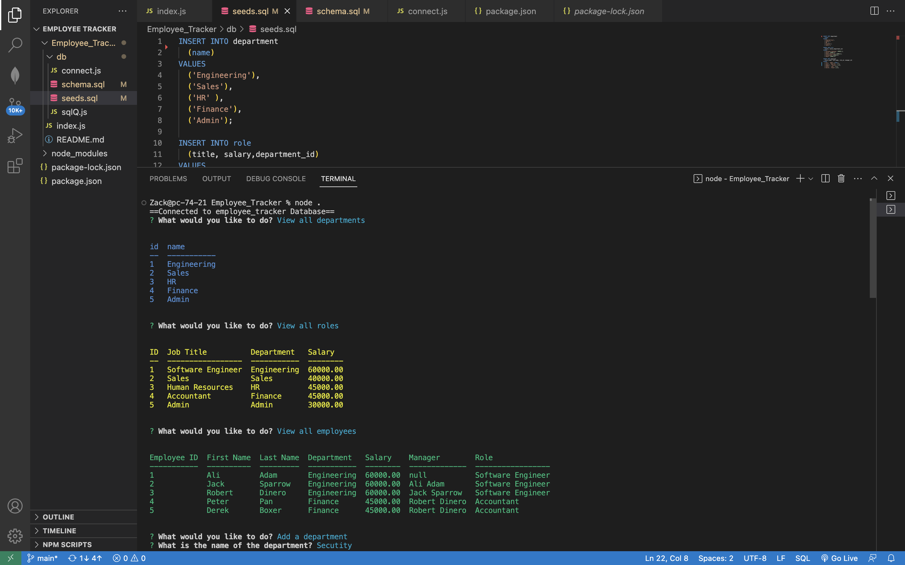

# New_Employee_Tracker

# Video Link
https://drive.google.com/file/d/1LAWOwHUWnIxqa8JNU164c-a-GcX_YpC9/view

## Table of Contents

- [Description](#description)
- [Installation](#installation)
- [Usage](#usage)
- [Contributors](#contributors)
- [Testing](#testing)
- [Additional Info](#additional-info)
- [Questions and Contribution instructions](#questions-and-contribution-instructions)

## Description:

This application was made to show how track employees in the workplace.

## Installation:

Use command npm install, then use command npm start to host locally and also update schema.sql and seeds.sql.

## Usage:

View all departments, roles and employees at your workplace. Add departments, employees and roles, also update an employee role.

## Contributors:

Sakariya Adam

## Testing:

-

## Additional Info:

- Github: [Sakariya95](https://github.com/Sakariya95)

## Questions and Contribution instructions:

Please contact this email address if you have any questions about the project or any feedback for improvement thanks.

- Email: niyyex@live.co.uk

## Licensing:

